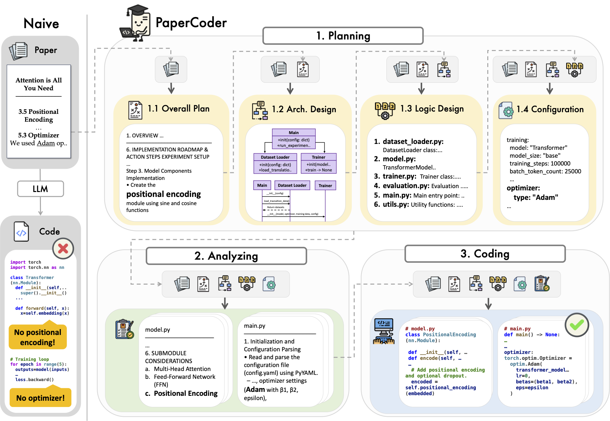
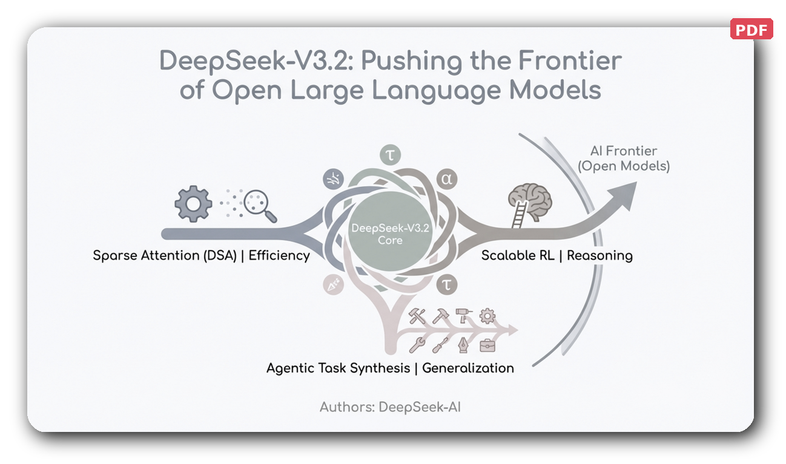
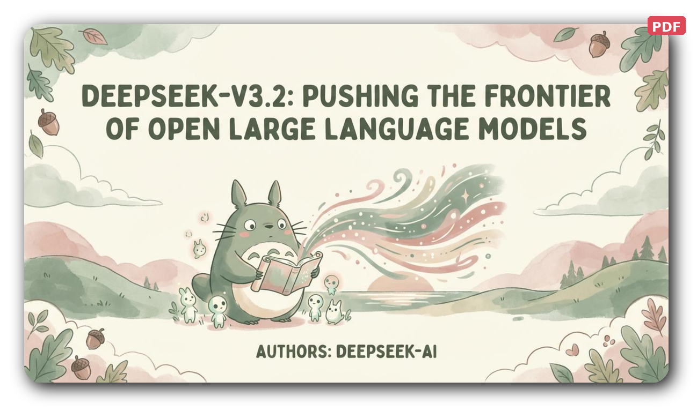

# 🚀 MONJEZ: Scientific Papers Agents Suite
### From Text to Triumph: An Autonomous Multi-Agent Pipeline for Research Communication

**A Submission for the [Agentic-thon](https://Agenticthon.com/) Hacka-thon**
 
by **Mohammad Karim Alzoubi** & **Osama Shakaki**

---

## 🎯 Our Mission
Scientific breakthroughs are often trapped within the dense, static confines of academic papers. The process of communicating research—translating complex ideas into code, posters, presentations, videos, and discussions—is a manual, time-consuming effort.

**MONJEZ is our answer.** It is an autonomous, multi-agent ecosystem that orchestrates a team of specialized AI agents to transform any scientific paper into a complete suite of communication assets. With a single command, MONJEZ converts static text into five dynamic formats:

| 💻 **Code** | 🖼️ **Posters** | 📊 **Slides** | 🎥 **Videos** | 🎙️ **Podcasts** |
|:---:|:---:|:---:|:---:|:---:|
| Executable Repositories | Professional & Visual | Polished Presentations | Engaging Video Abstracts | Conversational Audio |

---

## ✨ Meet the Agentic Suite
MONJEZ is composed of five expert agents, each a master of its domain, working in a sophisticated pipeline where precision meets creativity.

---

### 💻 The Code Agent: *From Theory to Executable Reality*
This agent reads the methodology and mathematical logic from a paper and autonomously writes a clean, modular, and functional code repository.

  

**Internal Workflow:**
- **Planning Agent:** Acts as the System Architect, designing the file structure and dependencies.
- **Analysis Agent:** Functions as a Research Scientist, meticulously interpreting equations.
- **Coding & Debugging Agents:** Senior Engineers that write and autonomously fix Python code.

---

### 🖼️ The Poster Agent: *From Paper to Pixel-Perfect Poster*
Condenses lengthy papers into visually stunning academic posters, ready for any conference.

  

**Internal Workflow:**
- **Parser Agent:** Distills text and visual assets (figures, tables) into a structured library.
- **Planner Agent:** Uses a binary-tree algorithm to partition the canvas for a balanced flow.
- **Painter & Critic Loop:** A VLM-powered loop that renders content and self-corrects layout issues.

---

### 📊 The Slides Agent: *From Data to Dazzling Slides*
Transforms documents into polished presentations, ensuring every key insight is captured via its RAG-powered core.

  

**Click on a preview to view the full PDF presentation:**

| Academic Style | Creative Style (Totoro) |
|:---:|:---:|
|  |  |
| 📄 *View Academic PDF* | 📄 *View Totoro PDF* |

**Internal Workflow:**
- **RAG Engine:** Indexes the paper to build a searchable knowledge base, preventing hallucinations.
- **Planning Agent:** Creates a blueprint mapping the narrative to a logical sequence of slides.
- **Creation Agent:** Renders final visuals with high-quality styling.

---

### 🎥 The Video Agent: *From Manuscript to Motion*
Produces dynamic video abstracts by translating academic concepts into animations, talking-head segments, and visually narrated slides.

#### 🧠 Strategic Workflow
Our Video Agent orchestrates a complex internal economy of specialist sub-agents to ensure high-fidelity results.

  
   
  <em><b>Autonomous Orchestration:</b> From Strategic Blueprinting (P-CoT) to a Multimodal Assembly Line with real-time visual critics.</em>

#### 📺 Live Demo: Autonomous Video Abstract

  <table style="border: none; border-collapse: collapse;">
    <tr>
      <td align="center" style="border: 2px solid #58a6ff; border-radius: 10px; padding: 10px; background-color: #0d1117;">
        <!-- استبدل الرابط أدناه بالرابط الذي ظهر لك عند سحب الفيديو -->
        <video src="https://github.com/user-attachments/assets/42593889-a2a3-4dad-bff2-50089df2bacc" width="100%" controls autoplay loop muted style="border-radius: 8px; box-shadow: 0 4px 8px rgba(0,0,0,0.5);"></video>
        

          <em><b>Case Study:</b> "A Fast Algorithm for Particle Simulations"   
          Notice the autonomous coordination between narration and mathematical Manim animations.</em>
        

      </td>
    </tr>
  </table>

---

### 🎙️ The Podcast Agent: *From Text to Talk Show*
Transforms a dense research paper into a lively, conversational audio podcast.

  

**Internal Workflow:**
- **Scriptwriting Agent:** Converts jargon into a natural, two-host dialogue script.
- **Audio Synthesis Engine:** Uses multi-voice TTS to generate distinct, natural voices.
- **Transcript Generator:** Provides a full text transcript alongside the `.mp3` output.

---

## 🧠 The Agentic Brain: Core Principles
1.  **Hierarchical Task Decomposition:** High-level goals are broken down into granular executable tasks.
2.  **Autonomous Self-Correction:** "Critic" agents evaluate outputs and provide iterative feedback.
3.  **Domain-Specific Expertise:** Specialists for `Manim` animations, `PyMOL` structures, and `pptx` rendering.
4.  **Headless & Modular:** Designed to run autonomously via CLI for massive research workflows.

---

## 🔒 Exclusive Access & Proprietary Rights

>[!IMPORTANT]
> **MONJEZ (Scientific Papers Agents Suite)** is a private, proprietary software suite and the exclusive intellectual property of **Mohammad Karim Alzoubi** and **Osama Shakaki**.

This repository is a dedicated submission for the **Agentic-thon Hacka-thon**. Access is strictly limited to authorized judges and evaluators. 

*   **Non-Open Source:** This project is **NOT** open-source. All rights are reserved by the authors.
*   **Usage Restriction:** Unauthorized cloning, copying, distribution, or execution of any part of this suite for any reason (academic, commercial, or personal) is strictly prohibited.
*   **Intellectual Property:** The orchestration logic, multi-agent communication pipelines, and integrated architectural frameworks represent original work created for this competition.
*   **No Liability:** Any unauthorized attempt to use or replicate this system will be considered a violation of intellectual property rights.

---

## 💡 Our Vision for Agentic-thon
MONJEZ is a statement about the future of agentic AI. We believe autonomous agents should **amplify human creativity**. By automating the friction-filled process of research communication, we empower thinkers to focus on their next big discovery.

---

## 🛠️ Built With
- **Core:** Python 3.14+
- **LLMs:** GPT-5.5, Gemini 3.1 Pro, Llama 4
- **Visualization:** Manim v0.20+, PyMOL 3.1+, python-pptx 1.0+
- **Audio/Video:** MoviePy 2.2+, Pydub 0.25+, FFmpeg 8.1+

---

## 👥 The Team
- **Mohammad Karim Alzoubi**
- **Osama Shakaki**

**We are proud to present MONJEZ as our contribution to a future powered by intelligent, collaborative AI agents.**
